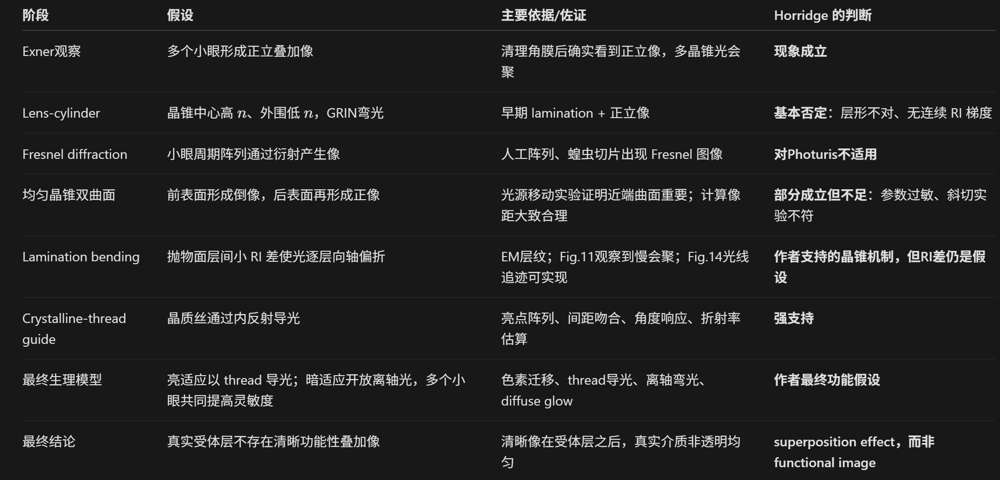
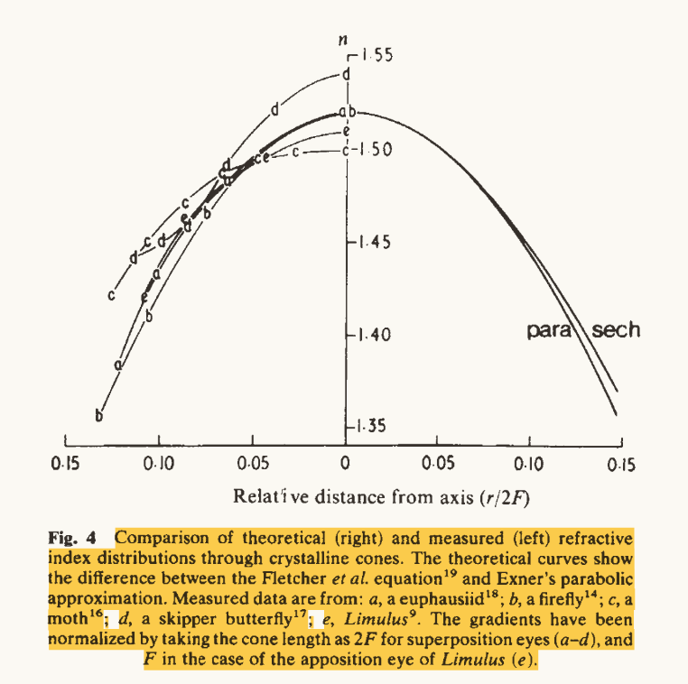
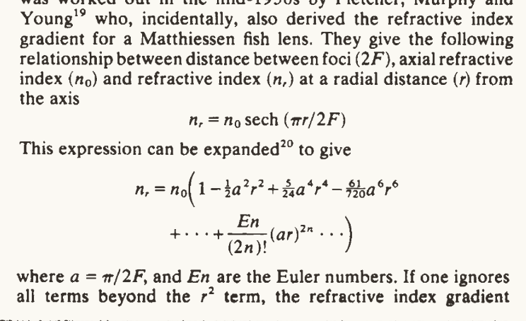
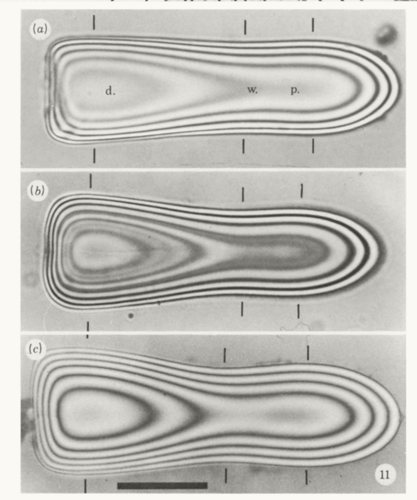

Burtt 和 Catton（1962）以及 Rogers（1962）进行了一系列与昆虫复眼解剖结构有关的研究。他们使用条纹图案，并测量 ERG（electroretinogram，视网膜电图），以确定昆虫眼的分辨率极限。他们发现，实际测得的分辨率比从行为实验中预测的更高。这些结果表明，昆虫眼的分辨能力似乎超过了由单个 ommatidium（小眼）孔径大小所允许的极限。

为了解释这种较高的分辨率，Rogers（1962）提出一种昆虫视觉理论：来自多个小眼的光相互作用，形成复杂的衍射图像。按照这一理论，昆虫眼相当于一个 diffraction grating（衍射光栅），可以产生多个级次的图像。在某些情况下，根据 rhabdomere 的长度，可以有三个这样的图像落在小眼的感受区域内。这个过程意味着多个小眼之间存在光学相互作用，从而增加有效孔径，并产生具有更高分辨率的图像。

Exner 1891 径向折射率梯度
Seitz 1969  干涉测量
Horridge 1969 层间高低折射率交替
Kunze & Hausen 1971：在讨论 moth crystalline cone 时明确回顾了 Exner 的径向折射率递减模型，并提到此前对 firefly pseudocone 的干涉测量支持 lens-cylinder-like refractive-index inhomogeneity。

**Compound eyes: old and newoptical mechanisms
重新支持了Exner，干涉显微镜测量结果支持晶锥存在折射率梯度分布

三种不同种类粪金龟晶锥的干涉条纹(a) _O. aygulus_, (b) _O. alexis_, (c) _O. westermanni_.