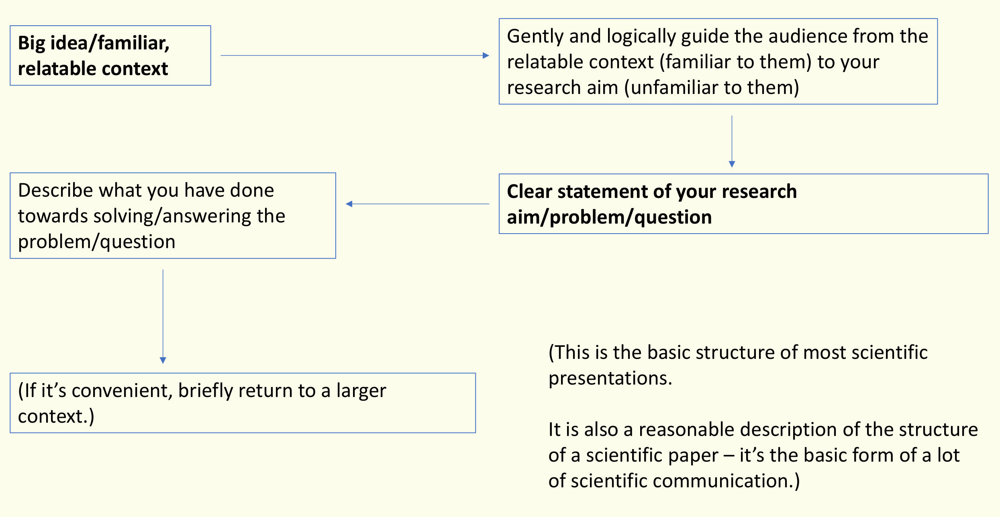

3-4 min
1 best, 2-3 slides alowed
smart materials➡photoreponsive materials➡what can they do?
soft robots/droplet manipulation

As you can see here, they are something we called smart materials, which means they response to some external stimuli, like electricity, magenet, heat or light.  

The specific kind of smart materials that can respond to light and transform light energy to other kinds of energy is what we called photoresponsive materials.

So, as we have already know these intresting properties of photoresponsive materials. the question is, what can we use it yo do?

actrully, we can use them to do lots of things, and im going to introduce one aspect of their applications, which is called droplet manipulation.

droplet manipulation is quite important in many area but just come from a small question. if i ask you how can you move a droplet on the table , you may use your finger to push the droplet or use you mouth.

But what will happen that droplet is in a x space, like chips. 

liquid crystal based optical elements inspired by compound eyes 
liquid crystal screen➡insect compound eyes ➡evolution theory?
